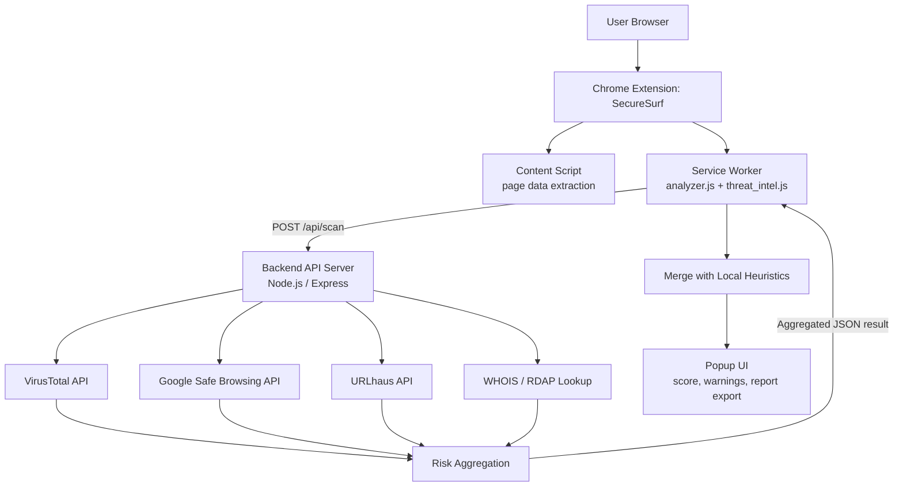

# 🛡️ SecureSurf

**SecureSurf** is a Chrome browser extension (Manifest V3) that analyzes the website a user is currently viewing and flags signs of phishing, malware distribution, and other web-based threats — combining fast, local heuristic checks with optional lookups against real threat-intelligence services.

> ⚠️ **Disclaimer:** SecureSurf is a security research / educational project built to demonstrate applied cybersecurity and secure software engineering practices. It is not a production-grade security product and should not be relied upon as a sole line of defense against phishing or malware.

---

## Table of Contents

- [Problem Statement](#problem-statement)
- [How SecureSurf Solves It](#how-securesurf-solves-it)
- [Features](#features)
- [System Architecture](#system-architecture)
- [Data Flow](#data-flow-step-by-step)
- [Technology Stack](#technology-stack)
- [Project Structure](#project-structure)
- [Installation Guide](#installation-guide)
- [Environment Configuration](#environment-configuration)
- [Screenshots](#screenshots)
- [Future Improvements](#future-improvements)
- [Disclaimer](#disclaimer)

---

## Problem Statement

Phishing sites, malicious URLs, and scam pages remain one of the most common ways attackers compromise everyday users — impersonating trusted brands, harvesting credentials over unencrypted forms, or quietly redirecting victims to malware. Most people have no easy way to check, in the moment, whether the page they're on is actually safe.

## How SecureSurf Solves It

SecureSurf runs in the background of the browser and evaluates the active page against a set of security checks, then aggregates the results into a single, human-readable risk score. It's designed to be useful even offline (local heuristics never depend on a network connection), while optionally enriching that score with live threat-intelligence data from a companion backend when one is configured and reachable.

## Features

| Feature | Status |
|---|---|
| URL / page structure analysis (local heuristics) | ✅ Implemented |
| Real-time monitoring with tab badge + risk notifications | ✅ Implemented |
| Context-menu "Scan this website" action | ✅ Implemented |
| Scan history per session | ✅ Implemented |
| Downloadable PDF / text scan reports | ✅ Implemented |
| Threat intelligence integration — VirusTotal, Google Safe Browsing, URLhaus | ✅ Implemented (backend) |
| Domain age / WHOIS (RDAP) lookup | ✅ Implemented (backend) |
| PhishTank integration | 🚧 In Progress — module exists but is not yet wired into the active scan endpoint |
| SSL/TLS certificate inspection (validity, expiry) | 🚧 In Progress — currently a client-side HTTPS heuristic only; no live certificate lookup yet |
| Machine-learning-based phishing detection | 🚧 Planned |

### Local heuristic checks (always run, no network required)

These run for every page directly from the extension's content script data, with no dependency on the backend:

- HTTPS enforcement
- Password form submitted over an insecure connection
- Mixed content (HTTP resources on an HTTPS page)
- Missing/weak security headers
- Suspicious redirect chains
- Domain-name heuristics (keyword spoofing, raw IP addresses, excessive subdomains, randomness/entropy in the domain, suspicious TLDs)
- Risky iframe usage
- Excessive/sensitive browser permission requests

### Backend-enriched checks (optional, require the SecureSurf backend to be running)

- **VirusTotal** URL reputation (engine detections)
- **Google Safe Browsing** threat-type matching
- **URLhaus** (abuse.ch) known-malware-URL lookup
- **WHOIS/RDAP** domain registration age (flags very recently registered domains)

If the backend is unreachable or a given provider has no API key configured, SecureSurf degrades gracefully — it simply continues with local-only analysis and marks that provider as unavailable, rather than failing the scan.

## System Architecture



### Data Flow (step-by-step)

1. **User visits a website.** The content script (`content.js`) extracts page-level signals: protocol, forms, headers it can observe, iframe usage, permission requests, etc.
2. **The service worker (`service_worker.js`)** receives that data and runs it through the local rule-based engine (`analyzer.js`), producing an initial risk score and list of passed/failed checks — entirely offline.
3. **If backend integration is enabled**, the service worker calls `threat_intel.js`, which sends only the target URL to the backend's `POST /api/scan` endpoint. No API keys ever leave the backend or reach the extension.
4. **The backend (`Server.js` → `scanRoute.js`)** validates the URL and fans the request out concurrently to VirusTotal, Google Safe Browsing, URLhaus, and the WHOIS/RDAP service, each in its own provider module. Any provider that fails, times out, or has no API key configured is marked unavailable rather than breaking the whole scan.
5. **Results are aggregated** into a single JSON payload (checks, warnings, and a bounded score contribution) and returned to the extension.
6. **The extension merges** the backend's contribution with its local analysis (`threat_intel.js`'s `mergeThreatIntel`), recalculates the final risk level, and updates the toolbar badge, notifications (if the risk threshold is crossed), and scan history.
7. **The popup UI (`popup.js` / `popup.html`)** renders the score, passed/failed checks, and warnings, and lets the user export the result as a PDF or text report (`Reportgenerator.js`, using `jsPDF`).

## Technology Stack

**Browser Extension**
- JavaScript (Manifest V3 Chrome Extension)
- HTML / CSS (popup UI)
- `jsPDF` (client-side PDF report generation)

**Backend**
- Node.js with Express
- `axios` for outbound HTTP calls to threat-intel providers
- `cors`, `helmet`, `morgan` for baseline HTTP security/logging
- `express-rate-limit` for request throttling
- `dotenv` for environment configuration

**External Threat Intelligence APIs**
- [VirusTotal](https://www.virustotal.com/) v3 API
- [Google Safe Browsing](https://developers.google.com/safe-browsing) v4 API
- [URLhaus](https://urlhaus.abuse.ch/) (abuse.ch) — no key required
- [RDAP](https://rdap.org/) domain registration lookups — no key required

**Development Tools**
- `nodemon` for local backend auto-reload

_No database is currently used — every scan is stateless and computed on demand; recent scans are kept only in the extension's in-memory/session history, not persisted server-side._

## Project Structure

```
secure_surf/
├── manifest.json            # Chrome extension manifest (MV3)
├── content.js                # Extracts page signals from the active tab
├── service_worker.js         # Extension background logic, badges, notifications
├── analyzer.js                # Local rule-based risk scoring engine
├── threat_intel.js           # Extension-side client for the backend /api/scan endpoint
├── popup.html / popup.js / popup.css  # Extension popup UI
├── Reportgenerator.js         # PDF/text scan report export
├── lib/
│   └── jspdf.umd.min.js      # Third-party PDF generation library
├── images/                   # Extension icons
│
├── Server.js                 # Express backend entry point
├── scanRoute.js               # POST /api/scan route handler
├── Env.js                     # Centralized environment/config loader
├── Logger.js                  # Minimal logging utility
├── Providerstatus.js          # Reports which providers are enabled at boot
├── Virustotal.js               # VirusTotal provider integration
├── googleSafeBrowsing.js       # Google Safe Browsing provider integration
├── urlhaus.js                  # URLhaus provider integration
├── whoisService.js             # WHOIS/RDAP domain-age provider integration
├── phishTank.js                 # PhishTank provider integration (not yet wired into scanRoute)
│
├── package.json / package-lock.json
├── .env.example                # Template for required environment variables
└── .gitignore
```

> **Note:** This repository also contains a few backend files (`scanController.js`, `riskAggregator.js`, and files under `middleware/`) written against an alternate `services/`/`config/`/`utils/` folder layout that isn't present in this project. They currently aren't imported by `Server.js` and represent an earlier structuring pass. They're safe to ignore, consolidate, or remove — flagging here rather than silently deleting them, since that's a decision for the project owner.

## Installation Guide

### Prerequisites
- Node.js ≥ 18
- Google Chrome (or another Chromium-based browser supporting Manifest V3)

### 1. Clone the repository
```bash
git clone https://github.com/<your-username>/securesurf.git
cd securesurf
```

### 2. Install backend dependencies
```bash
npm install
```

### 3. Configure environment variables
```bash
cp .env.example .env
```
Then open `.env` and fill in any provider API keys you have (see [Environment Configuration](#environment-configuration) below). Providers without a key are automatically skipped at runtime — the backend still works with whichever keys you do provide.

### 4. Start the backend
```bash
npm start        # production
npm run dev      # with nodemon auto-reload
```
The server listens on `http://localhost:3787` by default (configurable via `PORT`).

### 5. Load the extension in Chrome
1. Go to `chrome://extensions`
2. Enable **Developer mode** (top right)
3. Click **Load unpacked**
4. Select the `secure_surf/` project folder
5. Copy the extension ID Chrome assigns it, and set `EXTENSION_ORIGIN=chrome-extension://<that-id>` in your `.env` if you want to restrict the backend to only your loaded extension

## Environment Configuration

All configuration lives in a `.env` file (never committed — see `.gitignore`). A template is provided in `.env.example`:

| Variable | Purpose | Required? |
|---|---|---|
| `PORT` | Port the backend listens on | No (defaults to 3787) |
| `EXTENSION_ORIGIN` | Restricts backend access to your extension's origin | No |
| `REQUEST_TIMEOUT_MS` | Timeout per outbound provider request | No |
| `RATE_LIMIT_WINDOW_MS` / `RATE_LIMIT_MAX` | Backend rate-limiting window/threshold | No |
| `VIRUSTOTAL_API_KEY` | Enables VirusTotal lookups | Optional — disables that provider if blank |
| `GOOGLE_SAFE_BROWSING_API_KEY` | Enables Google Safe Browsing lookups | Optional — disables that provider if blank |
| `PHISHTANK_API_KEY` | Enables PhishTank lookups (module present, not yet wired in) | Optional |

URLhaus and WHOIS/RDAP require no API key and are always active as long as the backend has outbound internet access.

## Screenshots

> _Add screenshots of the popup UI (Home / History / Settings tabs) and a sample scan result here._
> 


| Popup — Home | Popup — Scan Result | Downloaded Report |
|---|---|---|
|  |  |  |


## Future Improvements

- Machine-learning-based phishing classification (beyond rule-based heuristics)
- Weighted, confidence-based threat scoring across providers
- Additional threat intelligence sources
- Real-time request blocking for confirmed-malicious pages
- Community-sourced user reporting/feedback loop
- Live SSL/TLS certificate inspection via the backend
- Wiring PhishTank into the active `/api/scan` aggregation

## Disclaimer

This project was built for security research and educational/portfolio purposes. It demonstrates applied concepts in browser extension security, secure API key handling, and threat-intelligence aggregation, and is not intended as a production security product.
